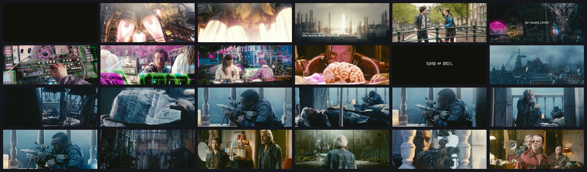
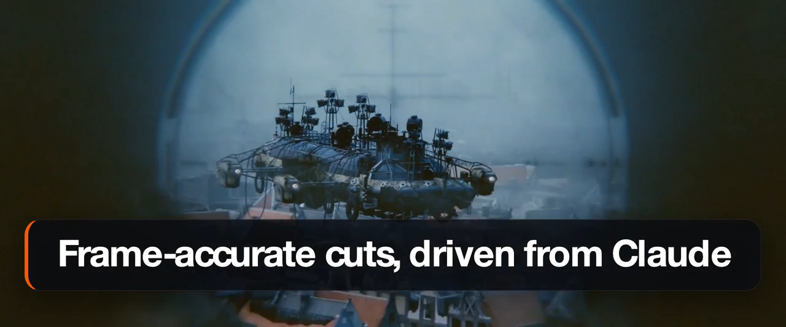
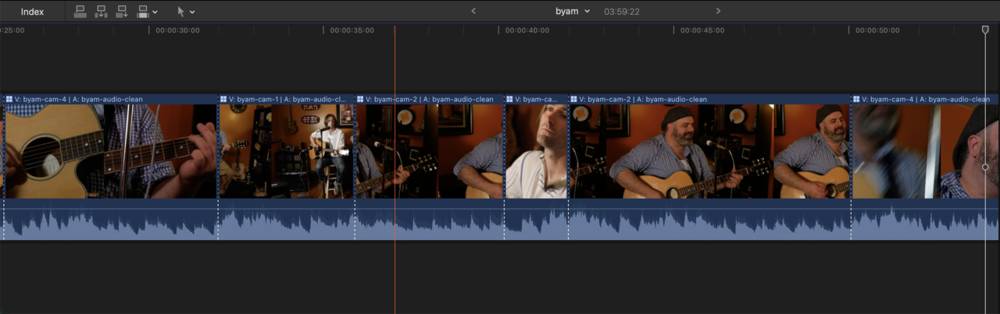
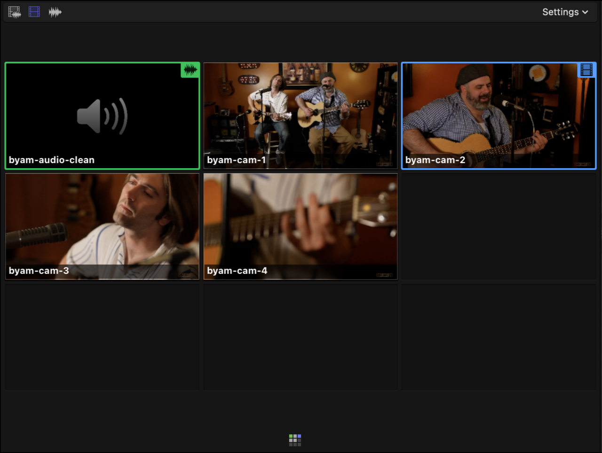

# video-studio

**Turn a long video into polished promo cuts — driven from [Claude Code](https://docs.claude.com/claude-code).**

<p align="center">
  <picture>
    <source type="image/webp" srcset="docs/media/teaser-hero.webp">
    
  </picture>
</p>

video-studio is a macOS toolkit + a Claude skill. You point Claude at your
footage — a long talk, a folder of clips, even several camera angles plus a
separate audio recorder — and ask for a teaser, a vertical social cut, or a
tightened long edit. Claude analyzes the footage, designs the cut, generates
animated overlays, composites everything with ffmpeg, and hands you a **finished
`.mp4`/`.mov`** — not a timeline you still have to render. Prefer to finish in
your own editor? It can instead export an **edit-grade Final Cut Pro project**.

> **This is an early concept.** It's an experiment in letting an AI assistant
> drive a real video-editing pipeline end-to-end. It works, but it's rough:
> macOS-only, opinionated, and the interfaces (the skill, the CLI flags, the
> toolkit layout) may change without notice while it's pre-1.0. Treat it as a
> sharp prototype, not a polished product.

---

## Highlights

- **You get a finished file, not a timeline.** Ask for a teaser, a 9:16 social
  cut, or a tightened long edit — and get back a rendered `.mp4`/`.mov`.
- **Claude is the vision model.** It describes the extracted frames itself to
  pick the right moments — **no cloud vision API and no required local model.**
- **Frame-accurate and resumable.** Full-decode scene detection with cached,
  resumable state — a re-run picks up where it left off instead of redecoding.
- **Word-level soundbite timing.** Whisper word boundaries mean cuts land
  between words, never mid-syllable.
- **Animated overlays.** Captions, lower-thirds, CTAs, and title cards rendered
  to transparent (alpha) video and composited in.
- **Many clips, one cut.** Draw a single edit from a whole folder of sources —
  takes, B-roll, different shoots — referenced by `(source, in, out)`.
- **Audio-synced multi-cam.** Group several cameras (and a separate field
  recorder) covering one event, sync them by **audio cross-correlation**, and cut
  between angles over a shared timeline — handling mismatched frame rates and
  long-take clock drift.
- **Hand off to Final Cut Pro.** Instead of a flat render, export edit-grade
  segments + alpha overlays + a **`.fcpxml`** — including a real **multicam
  clip** you can re-cut in FCP's angle viewer.
- **It checks its own work.** The result is verified by sampling frames and
  re-transcribing soundbites, so a botched overlay or a clipped word gets caught.

## How it works

The orchestration lives in a **Claude skill** ([`skills/video-studio/SKILL.md`](skills/video-studio/SKILL.md)) —
Claude reads it and runs the pipeline step by step while you steer the creative
calls. Under the hood it stitches together tools that are each good at one thing:

1. **Frame-accurate scene analysis** — ffmpeg does a full-decode scene-cut pass
   and extracts one representative frame per scene. **Claude describes those
   frames itself** (optionally Ollama can auto-describe them offline).
2. **Word-level soundbite timing** — [whisper](https://github.com/openai/whisper)
   transcribes with `--word_timestamps` so cuts land cleanly on word boundaries.
3. **Animated overlays** — title cards, lower-thirds, captions, and CTAs are
   authored as animated SVGs with [domotion-svg](https://www.npmjs.com/package/domotion-svg)
   and rendered to transparent (alpha) video.
4. **ffmpeg compositing** — segments are normalized to one spec, overlays are
   layered on, audio is synced for soundbites and silenced for B-roll, and the
   whole thing is concatenated into the final cut.
5. **Frame-sampled verification** — frames are sampled and soundbites
   re-transcribed to confirm the cut is clean.

<p align="center">
  
  <br><em>Frame-accurate scene analysis — one representative frame per detected scene.</em>
</p>

<p align="center">
  
  <br><em>An animated caption / CTA overlay, composited onto the cut.</em>
</p>

## More than one clip — and more than one camera

The pipeline isn't limited to a single file or a flat render:

- **Multiple sources.** Point it at a mix of files and folders; each is analyzed
  independently into a combined `sources.json`, and a cut freely interleaves
  segments from any of them — conformed to one project fps/frame size on output.
- **Multi-cam.** When clips cover one event from different angles, group and
  **audio-sync** them (`sync-multicam`) — an audio-only recorder track becomes the
  sync reference *and* the master audio; the cut switches angles over a shared
  timeline while the master audio runs underneath. Alignment is in real seconds
  (so 29.97 vs 30 just works), weak/silent audio falls back to a manual offset,
  and long-take clock drift is detected and rate-corrected.
- **Editor handoff.** Export the cut as a project folder of ProRes segments +
  ProRes 4444 alpha overlays + a `manifest.json` + a re-composite `rebuild.sh` +
  a **Final Cut Pro `.fcpxml`** — for a flat timeline or a live, re-cuttable
  **multicam clip**. Add your own transitions and grade in FCP.

<p align="center">
  
  <br><em>An audio-synced multicam cut handed off to Final Cut Pro — angle switches laid over the shared master audio.</em>
</p>

<p align="center">
  
  <br><em>The same clip stays a live, re-cuttable multicam in Final Cut Pro's angle viewer.</em>
</p>

## How the AI reads the video

The interesting intermediates are kept, so you can see how the model interpreted
the footage. Two real samples from [Tears of Steel](#credits) ship in
[`docs/samples/`](docs/samples/):

**Scene descriptions** — Claude views one representative frame per detected scene
and writes what it sees ([full sample](docs/samples/tears-of-steel.scenes.json)):

> **`00:00:56:16 → 00:01:04:11`** — Extreme close-up of a surgeon wearing a
> multi-lens optical loupe over one eye, leaning in over an exposed human brain on
> a tray and working it with fine instruments. Magenta surgical light and a tangle
> of tubing wrap the scene in a clinical, unsettling sci-fi-medical mood.
>
> **`00:04:17:22 → 00:04:55:03`** — The interior of a grand old cathedral reclaimed
> by nature: a towering baroque pipe organ and stone columns draped in green ivy,
> lit in moody blue. A lone figure hangs mid-air at the center.

**Word-level transcript** — whisper timing precise enough to cut soundbites between
words ([full sample](docs/samples/tears-of-steel.transcript.txt)):

```
[00:00:23.00 → 00:00:24.30]  You're a jerk, Tom.
[00:00:24.50 → 00:00:26.88]  Look, Celia, we have to follow our passions.
[00:00:30.42 → 00:00:34.32]  Why don't you just admit that you're freaked out by my robot hand?
[00:00:44.16 → 00:00:44.92]  We're done.
```

## Requirements

- **macOS** (it shells out to `ffmpeg`, `whisper`, and a headless browser, and
  the launcher uses Homebrew + the macOS GUI session for GPU work).
- **Node.js ≥ 18**.
- **[Claude Code](https://docs.claude.com/claude-code)** (`claude` on your PATH).
- `ffmpeg` / `ffprobe`, and `whisper` for soundbite timing. **Ollama is
  optional** — only needed if you want offline auto-descriptions instead of
  having Claude describe frames.

The launcher checks for all of these and offers to `brew install` the missing
ones, so you don't have to set them up by hand.

## Getting started

Run the launcher in the folder where your video lives:

```bash
npx video-studio .
```

It will:

1. Check the required tools and offer to install any that are missing.
2. Install dependencies and build the scene analyzer.
3. Install the `video-studio` Claude skill into `~/.claude/skills`.
4. Launch Claude Code in your working directory.

Then just tell Claude what you want:

> *"make a 15-second teaser from ~/Desktop/talk.mov"*

Other entry points:

```bash
npx video-studio --check        # doctor: report tool status, install nothing
npx video-studio --no-launch    # set everything up but don't start Claude
npx video-studio --skills-only  # (re)install just the Claude skill
npx video-studio --yes          # auto-install missing tools without prompting
npx video-studio --help
```

## When to use it

Reach for video-studio when you have **source footage** and want **short,
shareable cuts** out of it:

- A conference talk or webinar → a 15s teaser with a hook + CTA.
- A product demo → a vertical 9:16 reel for social.
- A raw screen recording → a tightened long edit with captions and title cards.
- A folder of takes / B-roll → one cut drawn across all of them.
- A multi-cam shoot (several angles + a recorder) → an audio-synced
  angle-switching cut, or a Final Cut Pro multicam clip to finish by hand.

It's **not** a general-purpose NLE — no color grading or audio mixing — and the
AI does the mechanical heavy lifting while you steer the creative calls. When you
*do* want to finish in a real editor, it hands off a Final Cut Pro project rather
than locking you into its render.

## How it's built

| Path | What it is |
|------|------------|
| [`skills/video-studio/SKILL.md`](skills/video-studio/SKILL.md) | The pipeline Claude follows — the primary interface. |
| [`bin/video-studio.mjs`](bin/video-studio.mjs) | The launcher: tool doctor, bootstrap, skill installer. |
| [`src/analyzer.ts`](src/analyzer.ts) → `dist/analyzer.js` | Resumable, frame-accurate scene detection (the `video-scene-analyzer` bin). |
| [`src/scene-math.ts`](src/scene-math.ts) | Pure fps / timecode / scene-merge math (unit-tested). |
| [`tools/render-caption.mjs`](tools/render-caption.mjs) | Caption / lower-third / CTA → animated SVG → alpha video. |
| [`tools/analyze-sources.mjs`](tools/analyze-sources.mjs) | Multiple-source input: files/folders → per-source analysis → `sources.json`. |
| [`tools/sync-multicam.mjs`](tools/sync-multicam.mjs) | Audio-sync a multi-cam group → `multicam.json` (over the pure DSP in [`tools/multicam.mjs`](tools/multicam.mjs)). |
| [`tools/export-project.mjs`](tools/export-project.mjs) | Editor handoff: cut spec → ProRes segments + alpha overlays + manifest + `rebuild.sh` + `.fcpxml` (with optional FCP transitions). |
| [`tools/render-transitions.mjs`](tools/render-transitions.mjs) | Bake the cut's transitions into a finished `.mov` with **no Final Cut Pro** — fast windowed re-encode, native dissolves/wipes/slides/insets/splits. |
| [`docs/multicam-sync.md`](docs/multicam-sync.md) · [`docs/editor-handoff.md`](docs/editor-handoff.md) · [`docs/multiple-sources.md`](docs/multiple-sources.md) · [`docs/render-transitions.md`](docs/render-transitions.md) | Feature specs for multi-cam, the editor handoff, multi-source input, and rendering transitions without FCP. |
| [`docs/manual-test-plan.md`](docs/manual-test-plan.md) | Manual checklist for the external-tool pipeline. |

## Development

```bash
npm install
npm run build        # compile the TypeScript analyzer to dist/
npm run lint         # eslint
npm run typecheck    # tsc --noEmit
npm test             # vitest unit tests + coverage
npm run check        # lint → typecheck → test → build (run before every change)
```

Tests cover the **pure, deterministic logic** — scene/timecode math, caption
assembly, the export manifest + FCPXML, source/multicam manifests, and the
multi-cam DSP (FFT cross-correlation, drift fit) — to **100%**. The
ffmpeg/whisper/ollama/browser pipeline can't be unit tested reliably; it's
covered by [`docs/manual-test-plan.md`](docs/manual-test-plan.md).

## Releasing

```bash
npm run release        # interactive stable release (bumps version, updates
                       # CHANGELOG, tags, pushes; CI publishes to npm)
npm run release:beta   # tag-only beta off HEAD; CI publishes under `@beta`
```

Release notes are drafted with [gitgist](https://github.com/brianwestphal/gitgist).
See [`docs/releasing.md`](docs/releasing.md) for the full flow and the one-time
npm trusted-publisher setup.

## Credits

The demo media and samples are derived from **Tears of Steel** — © Blender
Foundation, [CC BY 3.0](https://creativecommons.org/licenses/by/3.0/),
[mango.blender.org](https://mango.blender.org). Used here to demonstrate the
toolkit; video-studio itself doesn't bundle the film.

## License

[MIT](LICENSE) © Brian Westphal — see [LICENSE](LICENSE).
